# RENESAS + RT-Thread 传感器网关 DEMO

## 简介

这是一个基于 RA6M4-CPK 开发板 + RT-Thread 实现的传感器网关 DEMO。

本文将介绍如何一步步从零搭建一个传感器网关。

下图是整体的设计框图，移远 EC20 Cat1 模组用于网络通信。在主控芯片中添加所需要的软件包、组件等中间件来快速搭建起一个传感器网关。

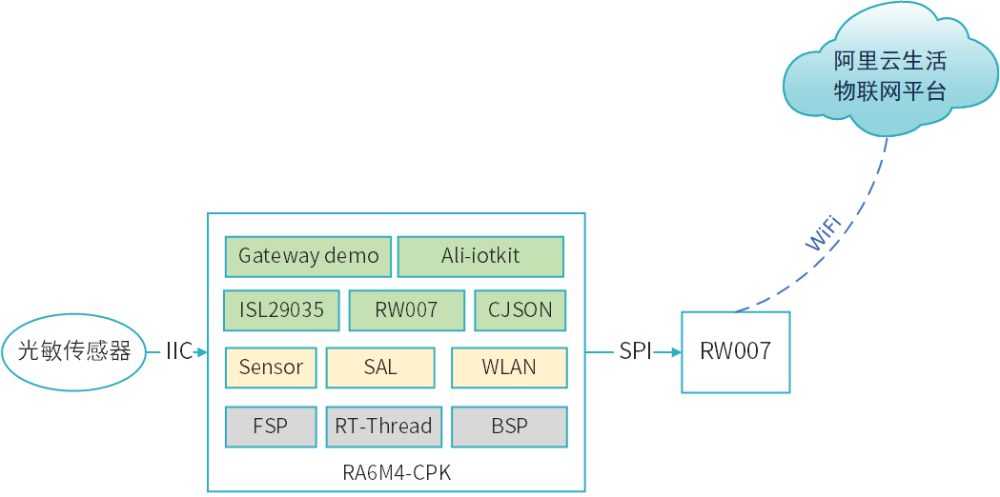

## 实际运行效果

1、等待 Cat1 模组使用 PPP 联网成功

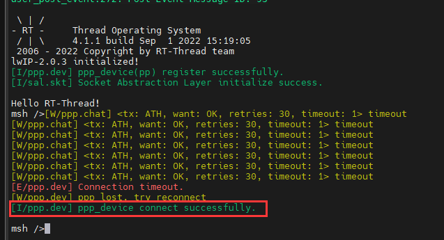

2、在 msh 中输入`linkkit_demo` 命令创建并启动 demo 线程

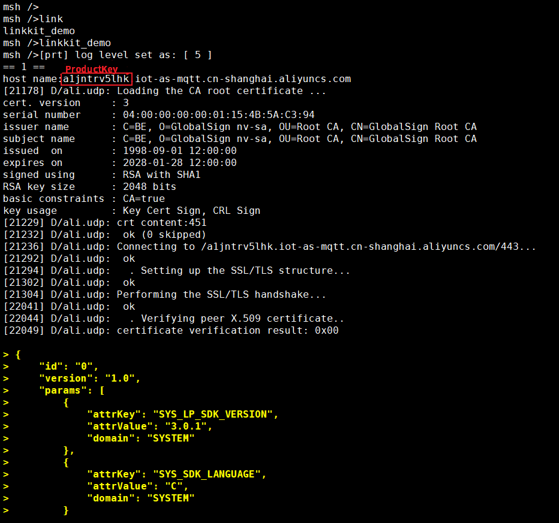 

2、在云平台的设备调试页面查看实时刷新的数据。

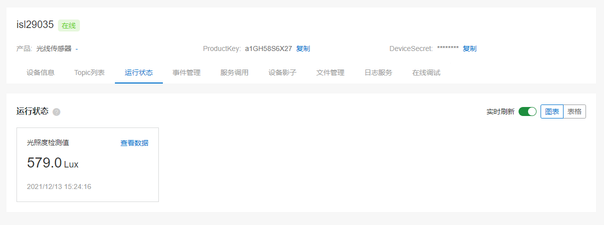 

## 准备工作 

- 阿里云：[生活物联网平台](https://living.aliyun.com/)
- [RA6M4-CPK 开发板](https://www2.renesas.cn/cn/zh/products/microcontrollers-microprocessors/ra-cortex-m-mcus/cpk-ra6m4-evaluation-board)
- USB-TTL：连接 UART6 （TX:P305; RX:P304）**波特率 115200**
- 网络模块：移远 EC20 Cat1

## 实现过程

1. 下载必备的开发工具，[参考文档](https://gitee.com/rtthread/rt-thread/tree/master/bsp/ra6m4-cpk) 搭建好软件开发环境。
2. 将网络模块连接开发板。
3. 插入 SIM 卡，要注意插卡方向。
   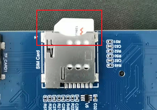 

- 实物连接图

   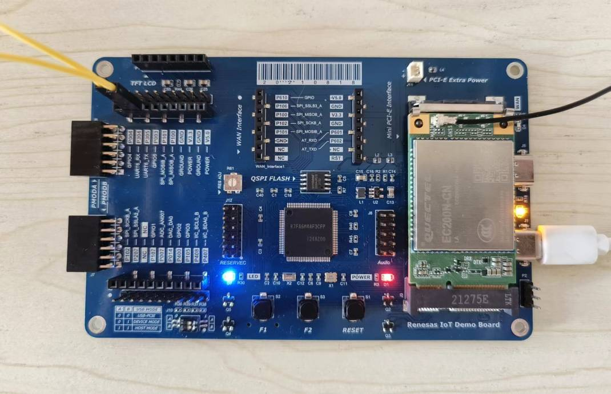

4. 编译、下载，验证运行结果

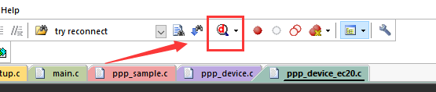

  - 查看系统运行情况
  >输入命令 `help`、`ps`、`free`、`list_device` 等命令查看系统运行状态

5. 连云配置

  - 在[云平台](https://living.aliyun.com/)创建项目，创建完成后点击项目进入配置

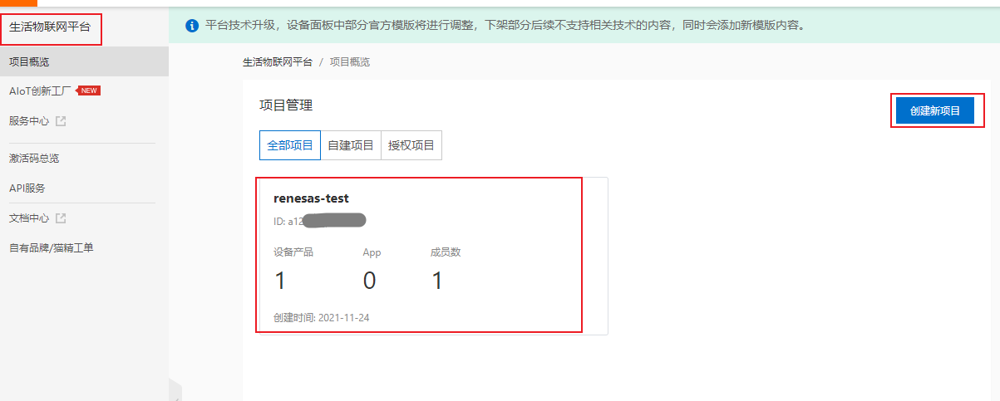 

  - 在新建的项目中创建产品

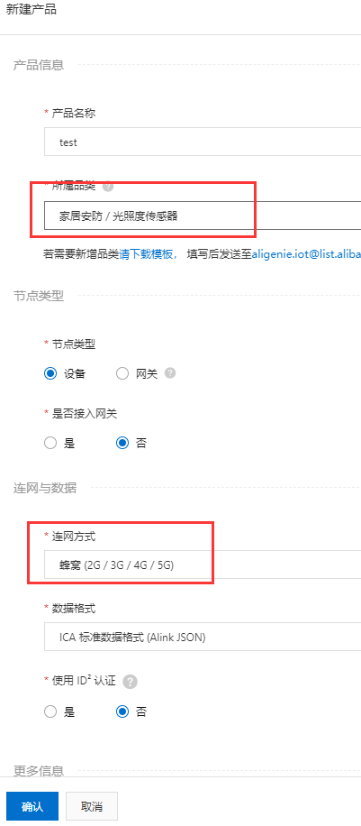 

  - 进入设备调试页面选择将页面拉到最下方选择 “EC20”模组

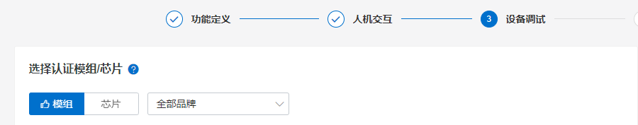

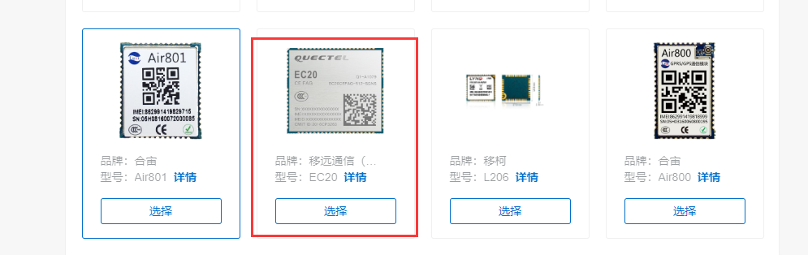 

  - 新增测试设备 “renesas_test”（随便输入）

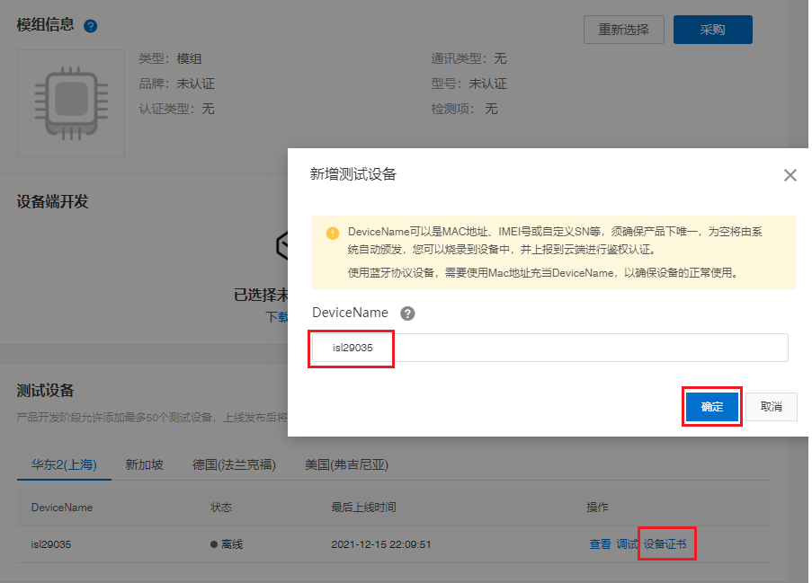 

  - 在 menuconfig 中开启 ali-iotkit 软件包，将新创建的产品三元组信息填入配置项中。保存配置信息，编译、下载工程。

  > 注意：三元组信息是一机一密，所以不能有两个以上的设备使用同一组三元组信息。
  > 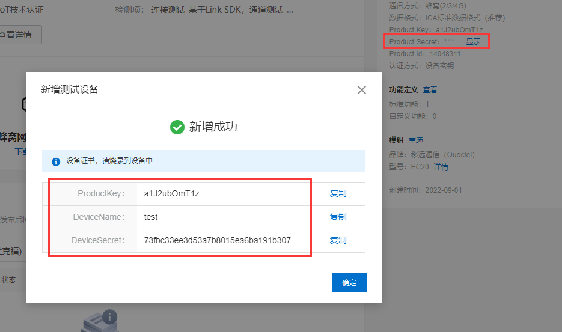
  >
  > 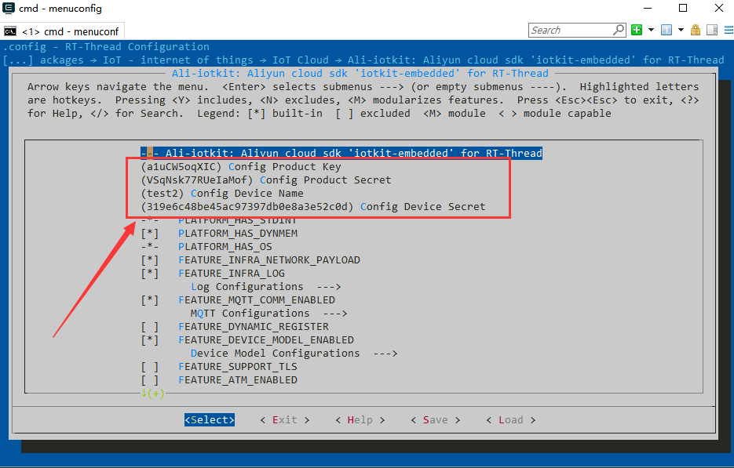 

6. 编译、下载，验证传感器网关数据上报功能。

  >命令行输入 `linkkit_demo` 命令，启动网关 demo 程序。在设备详情页查看实时上报信息
  > 

## 开源代码

整个 demo 的代码开源到 Github：[跳转链接](https://github.com/Rbb666/renesas_sensor_gateway_demo)

## 更多资料

- [开发板官网主页](https://www2.renesas.cn/cn/zh/products/microcontrollers-microprocessors/ra-cortex-m-mcus/cpk-ra6m4-evaluation-board)
- [开发板用户手册](https://www2.renesas.cn/cn/zh/document/mah/1527156?language=zh&r=1527191)
- [瑞萨RA MCU 基础知识](https://www2.renesas.cn/cn/zh/document/gde/1520091)
- [RA6 MCU 快速设计指南](https://www2.renesas.cn/cn/zh/document/apn/ra6-quick-design-guide)
- [RA6M4_datasheet](https://www2.renesas.cn/cn/zh/document/dst/ra6m4-group-datasheet)
- [RA6M4 Group User’s Manual: Hardware](https://www2.renesas.cn/cn/zh/document/man/ra6m4-group-user-s-manual-hardware)
